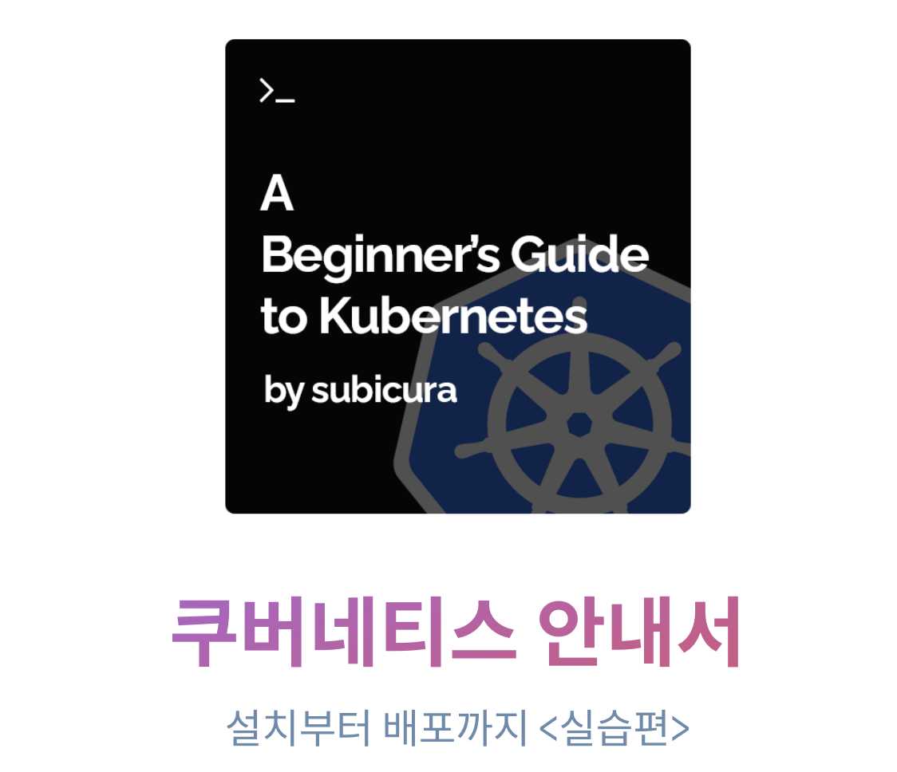

# kubernetes 기본 가이드

## 쿠버네티스 안내서

기존 실습 자료를 바탕으로 새로운 페이지로 이관하였습니다. 자세한 내용은 [쿠버네티스 안내서](https://subicura.com/k8s/)에서 확인하세요.

새로운 소스는 [여기](https://github.com/subicura/k8s)있습니다.

## 소개

이번 가이드는 docker와 docker-compose를 간단하게 알아보고 최종적으로 kubernetes의 기본 기능을 실습하도록 구성되어 있습니다.

### 참고 자료

- [초보를 위한 도커 안내서 - 도커란 무엇인가?](https://subicura.com/2017/01/19/docker-guide-for-beginners-1.html)
- [쿠버네티스 시작하기 - Kubernetes란 무엇인가?](https://subicura.com/2019/05/19/kubernetes-basic-1.html)

### 실습 전 준비사항

다양한 환경에서 실습을 진행할 경우 예상하지 못한 문제가 발생하는 경우가 많아 가급적 동일한 환경을 사용합니다. AWS를 사용하며 비용은 8시간 기준 500원 정도가 발생합니다.

- [Workshop 개발 환경 셋팅하기](https://github.com/subicura/workshop-init)

## 가이드

- [Guide 01 - Docker](./guide/guide-01.md)
  - [Task 1. Docker 기본 실습](./guide/guide-01.md#task-1-docker-기본-실습)
- [Guide 02 - Docker Compose](./guide/guide-02.md)
  - [Task 1. Docker Compose 기본 실습](./guide/guide-02.md#task-1-docker-compose-기본-실습)
- [Guide 03 - Kubernetes](./guide/guide-03.md)
  - [Task 1. kubectl](./guide/guide-03/task-01.md)
  - [Task 2. pod](./guide/guide-03/task-02.md)
  - [Task 3. replicaset](./guide/guide-03/task-03.md)
  - [Task 4. deployment](./guide/guide-03/task-04.md)
  - [Task 5. service](./guide/guide-03/task-05.md)
  - [Task 6. load balancer](./guide/guide-03/task-06.md)
  - [Task 7. ingress](./guide/guide-03/task-07.md)
  - [Bonus. Horizontal Pod Autoscaler](./guide/guide-03/bonus.md)

## 문의 & 궁금한 사항

페이스북 메신저 또는 트위터로 연락주세요.

- http://slack.opencontainer.co.kr
- https://www.facebook.com/subicura
- https://twitter.com/subicura
- subicura(at)subicura(dot)com
